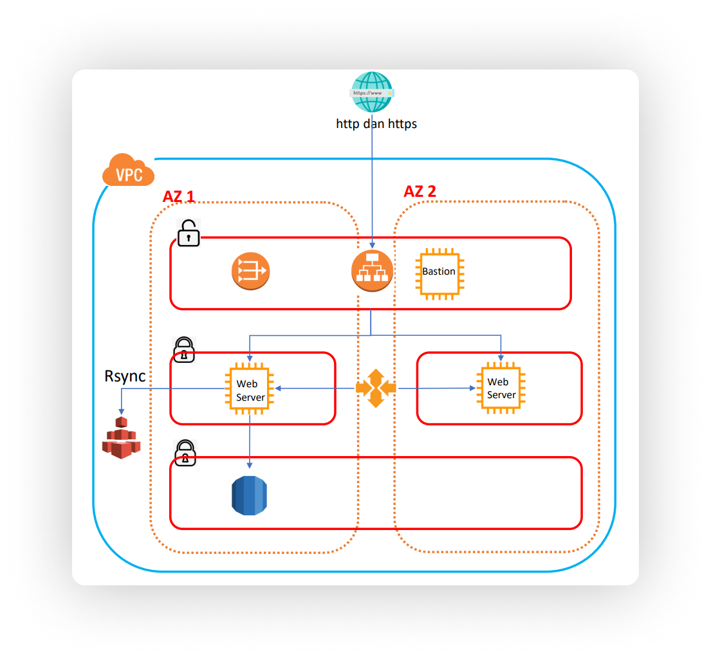
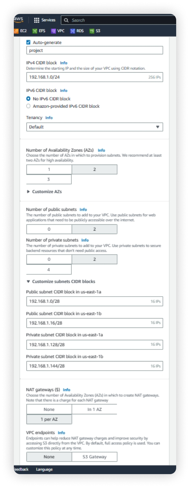
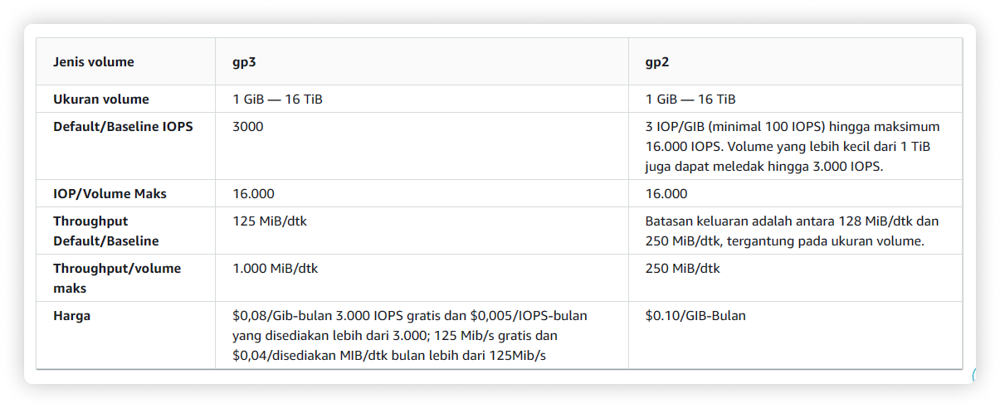
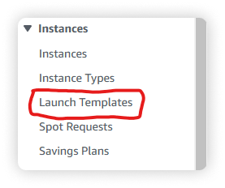
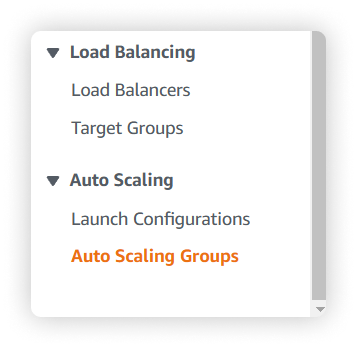

<!-- Project Logo -->
 

    
    <h3 align="center">School Project - AWS Project 4</h3>
     

        Rangkuman dan catatan ini dikhususkan untuk tugas AWS Project 4
    

     

# Tentang Project

    Github repositori ini merupakan catatan, rangkuman, dan dokumen pada video tutorial berjudul <a href="https://www.youtube.com/watch?v=JmUMBKs3Y0c">Konfigurasi Load Balancing, Auto Scaling , Rsync EFS Di EC2 Amazon Web Services - AWS eps-4</a> dikembangkan oleh <a href="https://github.com/OmTegar/">OmTegar</a>. Repositori ini dikhususkan untuk tugas sekolah AWS-Project 4. Kalian bisa simpan catatan ini untuk dijadikan referensi dan perkembangan ilmu di dunia Cloud Computing (AWS).

# Topologi Project

Ini merupakan contoh topologi yang akan kita gunakan untuk praktek di dalam AWS Management Console.
Berikut beberapa service AWS yang kita butuhkan untuk praktek :

- **VPC**
- **AWS EC2**
- **EFS**
- **RDS**
- **AWS Auto Scaling**
- **Auto Balancing**

# Membuat VPC

Silahkan buka service VPC lalu pilih `Create VPC`. Setelah itu silahkan buat VPC dengan contoh konfigurasi seperti dibawah ini :

- **Name**          : Project4
- **IP CIDR**       : 192.168.1.0/24
- **AZs**           : 2 (US-1a and US-1b)
- **Subnets**       : 2 (2 public and 2 private) 
- **NAT Gateways**  : 1 per AZ
- **VPC endpoints** : None

# Membuat Database

Silahkan buka service RDS lalu pilih `Create database`. Setelah itu silahkan buat database dengan contoh konfigurasi seperti dibawah ini
- **Engine**  : MySQL, Memilih MySQL karena lebih mudah digunakan dan umum
- **Templates**  : Free Tier, Menggunakan Free Tier karena database ini hanya digunakan praktek dan eksperimen
- **DB Instance Name** : db-project4, Nama database servernya bebas
- **Master Username**  : admin, Nama username bebas
- **Master Password**  : 12345678, Password username bebas
- **DB Instance Class**  : db.t3.micro, Menggunakan type instance t3.micro
- **Storage Type**  : General Purpose SSD (gp2), Berikut perbedaan jenis storage gp2 dan gp3

- **Allocate Storage** : 20GiB, Menggunakan storage SSD dengan kapasitas sekitar 20GB
- **Storage Autoscaling** : Enable, Otomatis menambah kapasitas storage ketika penuh hingga mencapai batas autoscaling yaitu sekitar 1000GB / 1TB
- **Compute Resource** : Don't connect to an EC2 compute storage, Memilih untuk tidak mengsetup database ke EC2 secara langsung
- **Network Type** : IPv4, Hanya menggunakan IP dengan versi 4
- **VPC** : project4-vpc, Pilih VPC yang berusan kita buat tadi
- **DB Subnet Group** : Create New, Membuat subnet group baru
- **Public Access** : No, Karena RDS bertepatan pada subnet private AZ US-1a sesuai dengan gambar topologi diatas
- **VPC Security Group** : Create New, Membuat security group baru untuk konektivitas
- **Security Group Name** : RDS-sg, Untuk nama terserah kalian
- **Availibity Zone** : us-east-1a, Memilih us-1a karena subnet tersebut merupakan subnet private dari AZ us-east-1a sesuai dengan gambar topologi 

<h3>Additional Configuration RDS</h3>

Karena pembuatan database ini hanya digunakan untuk praktek atau eksperimen, kita perlu mematikan beberapa fitur dari _additional configuration rds_ yaitu
- **auto backup** : disable, mematikan sistem auto backup
- **encryption** : disable, mematikan sistem enkripsi pada database
- **auto minor** : disable, mematikan sistem maintenance yaitu minor version upgrade

# Membuat Instance EC2 dan autoscaling

<h3>Membuat Template EC2</h3>
Launch Template pada AWS EC2 adalah sebuah template yang digunakan membuat instance secara konsisten. Dengan menggunakan launch template, pengguna dapat membuat instance dengan konfigurasi yang sama secara konsisten, sehingga tidak perlu lagi melakukan konfigurasi manual setiap kali membuat instance.
 

Silahkan buka service EC2, jika halaman dashboard sudah terbuka dibagian sidebar atau panel sebelah kiri terdapat menu `Launch Templates`, klik menu tersebut dan kita akan diarahkan untuk membuat EC2 launch template dan klik `Create launch template`.

Silahkan ikuti contoh konfigurasi untuk membuat template EC2 seperti di bawah ini :
- **Template Name** : template-project4, Nama dari template yang kita buat
- **Template Ver Desc** : praktek project4, Deskripsi untuk template
- **OS Images** : Debian, Kita akan mencoba membuat instance dengan OS Linux Debian
- **Instance Type** : t3.micro, Karena dengan type instance t3.micro memiliki spesifikasi yg agak besar yaitu 2vCPU dan 1GB RAM
- **Key Pair** : Vockey, Key pair lebih mudah di akses menggunakan vockey
- **Security Group Name** : template-webserver, Membuat security group baru dengan nama terserah
- **Desc SG** : template, Deskripsi security terserah
- **Inbound Rules** : SSH, HTTP, HTTPS, source type anyware semua.

<h3>Membuat Autoscaling Group</h3>
Autoscaling group memungkinkan pengguna untuk mengatur skala otomatis pada instance EC2. Pengguna dapat mengatur jumlah instance EC2 yang dibuat secara otomatis sesuai dengan permintaan, sehingga dapat meminimalkan biaya dan memaksimalkan kinerja instance.

Silahkan buka service EC2, jika halaman dashboard sudah terbuka dibagian sidebar atau panel sebelah kiri terdapat menu `Auto Scaling Groups`, klik menu tersebut dan kita akan diarahkan untuk membuat EC2 launch template dan klik `Create Auto Scaling Group`.

Silahkan ikuti contoh konfigurasi untuk membuat auto scaling group seperti di bawah ini :
- **Auto Scaling Group Name** : ASG-project4, Nama terserah
- **Launch Template** : template-project4, Pilih template yang barusan kita buat
- _**Next**_
- **VPC** : project4-vpc, Pilih VPC yang barusan dibuat tadi
- **Az Dan Subnet** : private 1a dan private 1b, Pilih subnet private 1a dan 1b karena instance akan di taruh kedalam subnet tersebut sesuai dengan topologi diatas
- _**Next**_
- **Load Balacing** : Attach to a new load balancer, Dengan memilih pilihan tersebut akan secara otomatis instance yang di konfigurasi dengan auto scaling akan terpasang auto balancer
- **Load Balancer Type** : Application Load Balancer
- **Load balancer scheme** : internet-facing, jenis load balancer yang ditempatkan di jaringan publik atau internet-facing subnet.
- **Network Mapping Az dan Subnets** : Pilih public subnet semua dari US-1a dan US-1b
- **Listeners and routing** : Create a target group
- **Health Checks** : ELB Checklist, Fungsi utama dari ELB adalah untuk meningkatkan ketersediaan dan skalabilitas aplikasi, memastikan bahwa permintaan pengguna diproses oleh instance EC2 yang tersedia, dan mengelola kesehatan instance EC2 untuk mencegah lalu lintas yang dibagikan ke instance yang tidak sehat.
- _**Next**_
- **Group Size** : Desire Capacity=2, Mini Capacity=2, Max Capacity 5. Yang berfungsi autoscaling akan secara otomatis membuat 2 instance sekaligus dengan maksimal kapasitas 5
- _**Next**_
- _**Next**_
- _**Next**_
- _**Create Auto Scaling group**_

Silahkan untuk check kembali instance, target group, dan load balancer apakah sudah sukses berjalan normal. Pastikan untuk instance sudah terdapat 2 instance dengan OS Debian dan health check pada target group berstatus health warna hijau.

<h3>Mengatur Security Group</h3>
RDS security group akan kita tambahkan ke dalam template security group yang bertujuan agar instance yang kita create menggunakan auto scaling akan memeliki akses ke RDS.
